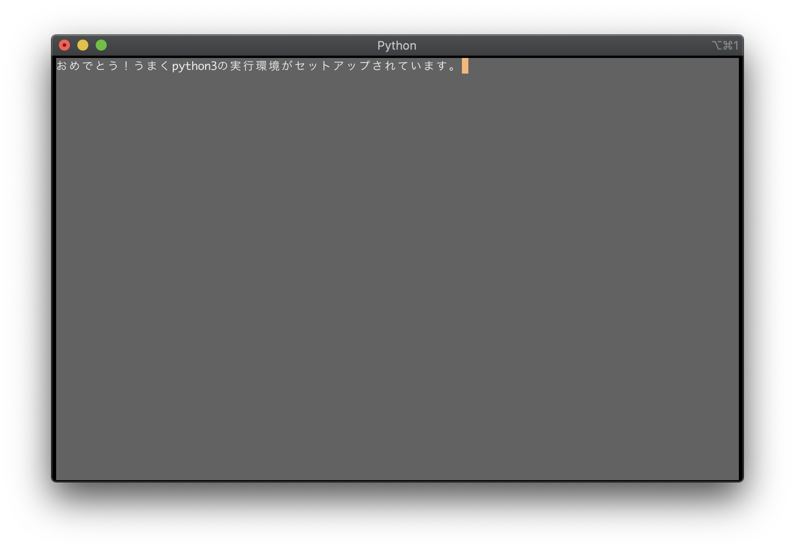

# python3 で curses が利用可能かチェックするプログラム

このプログラムは python3 で curses が利用可能かどうかをチェックします。

## git でリポジトリをチェックアウトする

```text
$ git clone https://github.com/nebosuke/python3-check-curses.git
```

## python3 がうまくインストールできれているかを確認する

```text
$ cd python3-check-curses
$ python3 check.py
```


